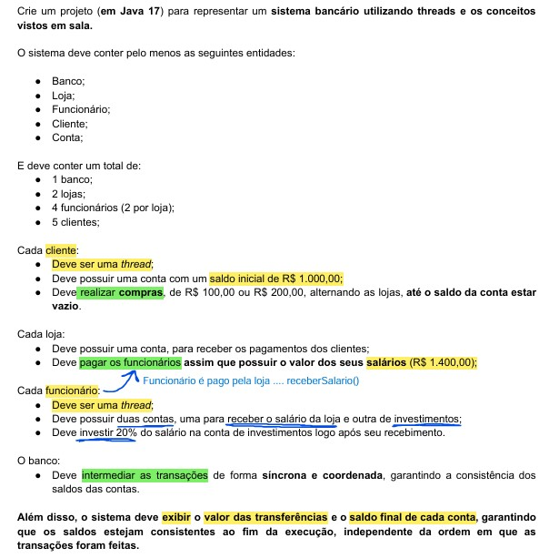

# Projeto 1 (AT2/N1) - Sistema Bancário utilizando Threads

## Índice 
- [Quanto a importação do projeto](#quanto-a-importação-do-projeto)
- [Funcionalidades implantadas no projeto](#hammer-funcionalidades-implantadas-no-projeto)
- [Enunciado do projeto](#enunciado-do-projeto)
- [Técnicas e tecnologias utilizadas](#️-técnicas-e-tecnologias-utilizadas)
- [Autores](#autores)

## Quanto a importação do projeto

  <h4> Atenção - o projeto foi realizado utilizando a IDE do Intellij, para fazer a importação do projeto no eclipse:</h4>
    

     I. Forma - realizar o Download ZIP do projeto: 
      1. Na opção file, dentro do eclipse, selecione "Open Projects from File System... 
      2. Selecione Directory e importe o arquivo já extraido, em seguida clique em Finish
    

    

      II. Forma - clone o repositório (criar uma cópia local de um repositório Git remoto): 
       ... - Web URL - https://github.com/Kennedy-Torres/sistema-bancario-threads.git 
    

  

## Organização das branchs

  <h4>
    

    O projeto foi dividido em 2 branchs: master e dev. A master é a branch onde está o projeto final com o pacote Classes (Banco, Cliente, Conta, Funcionario e Loja) e o pacote Programa (main), dev é a           branch onde foi realizada todo o desenvolvimento e criado alguns testes no processo para testar as funcionalidades. Em suma, foi realizado um merge da branch dev para branch master.
    

  </h4>

## :hammer: Funcionalidades implantadas no projeto

- `Funcionalidade 1`: Criação do método transferir() na classe Banco; ele vai ser utilizado em todas as funcionalidades que envolva o fluxo de saldo entre as contas.
- `Observação 1`: Dentro do método transferir() tem as funções debitar(), que retira saldo da conta, e creditar(), que adiciona saldo na conta, desenvolvidas na classe Conta.
- `Funcionalidade 2`: Classe Cliente é uma thread no qual realiza o fluxo do saldo da conta do cliente para conta da loja (ATO DO CLIENTE REALIZAR UMA COMPRA NA LOJA), com a lógica dentro do método run() .
- `Funcionalidade 3a`: Classe Funcionário é uma thread no qual realiza o fluxo do saldo da conta da loja para conta de salário do funcionário. (ATO DO FUNCIONÁRIO RECEBER O PAGAMENTO FEITO PELA LOJA), com a lógica dentro do método run().
- `Observação 2`: As threads do Funcionário só vão ser "startadas" quando todas as threads dos clientes terminarem sua execução. 
- `Funcionalidade 3b`: Ainda na classe Funcionário, ele tbm vai realizar o fluxo do valor recebido pela loja entre as suas duas contas: conta salário e conta investimento, sendo a conta investimento = 20% do salario recebido; com a lógica dentro do método run().
- `Observação 3`: O saldo final das contas só vai ser impresso no terminal quando todas as threads (no caso dos funcionários, pois para as threads funcionarios iniciarem as threads clientes devem ter finalizado) terminarem suas execuções, pois precisamos dos dados que elas irão fornecer. ( - join() ).

## Enunciado do projeto

  
## ✔️ Técnicas e tecnologias utilizadas

## Autores

| [ Kennedy Torres](https://github.com/Kennedy-Torres) | 
| :---: |
